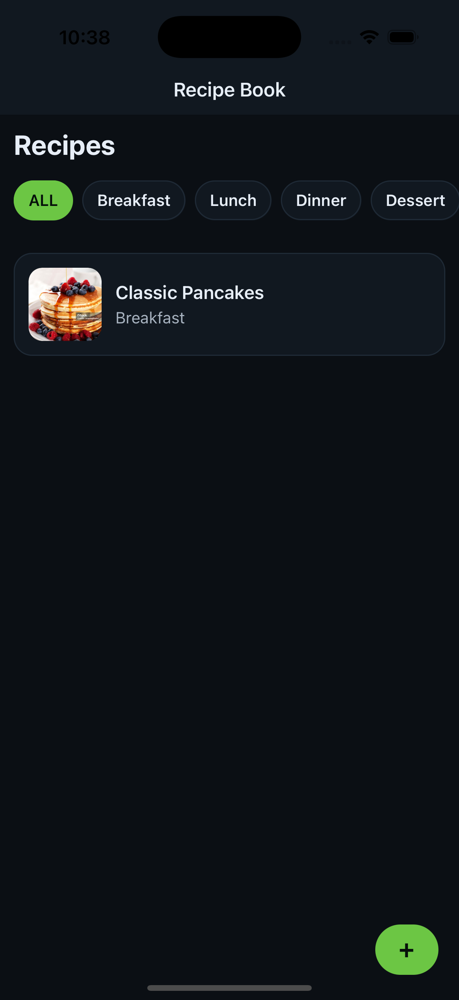
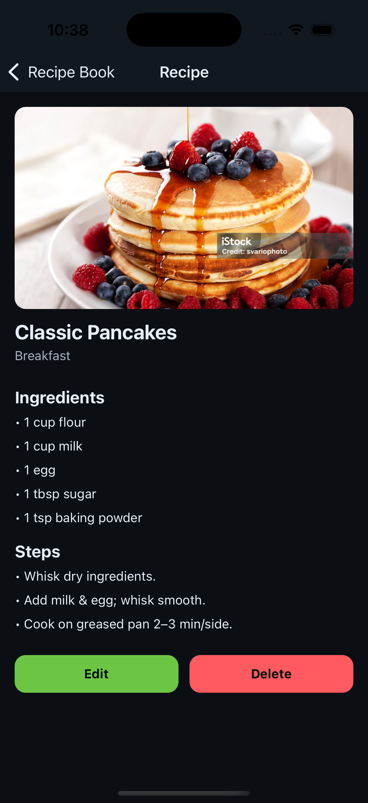
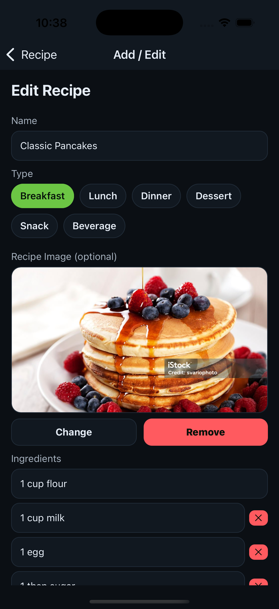

# RecipeApp (React Native)

A tiny offline recipe manager built with React Native.  
Create, edit, and browse recipes with images, ingredients, and step-by-step directions.

## ✨ Features

- Recipe list with type filter chips (All, Breakfast, Dessert, etc.)
- Add/Edit recipe with:
  - Image picker (camera or gallery) + permission checks (iOS/Android)
  - Discard-changes guard (fancy bottom sheet)
  - Keyboard-safe layout (iOS/Android)
  - Remove rows (ingredients/steps) with first row pinned
- Detail screen with:
  - Placeholder if no image
  - “No ingredients/steps” empty states
  - Fancy delete confirmation sheet
- Local storage (AsyncStorage) with bootstrap sample data

---

## 📸 Screens


| HomeScreen                                      | Detail                                                | Add/Edit                                               |
| ----------------------------------------------- | ----------------------------------------------------- | ------------------------------------------------------ |
|  |  |  |

---

## 🧱 Tech Stack

- React Native (TypeScript)
- React Navigation (native stack)
- AsyncStorage (via your `recipeStore`)
- `react-native-image-picker`
- `react-native-permissions`
- `react-native-safe-area-context`

---

## 🚀 Getting Started

### 0) Requirements

- Node 18+ (LTS recommended)
- Yarn or npm (examples use Yarn)
- Xcode (for iOS)
- Android Studio + SDK (for Android)
- Ruby + CocoaPods (iOS only)
  - If you use `rbenv`: `rbenv install 3.2.2` then `gem install cocoapods`

### 1) Install deps

```bash
yarn
# or: npm install
```

### 2) iOS setup

```bash
cd ios
pod install
cd ..
```

If you see `can't find gem cocoapods`, install pods first:

```bash
gem install cocoapods
pod --version
```

Then:

```bash
yarn ios
# or: npx react-native run-ios
```

### 3) Android setup

Start an emulator (or connect a device), then:

```bash
yarn android
# or: npx react-native run-android
```

---

## 🔐 Permissions

We request camera and photo library access when the user chooses “Add Photo → Take Photo / Gallery”.

### iOS

Ensure `Info.plist` contains:

```xml
<key>NSCameraUsageDescription</key>
<string>We use the camera to take a recipe photo.</string>
<key>NSPhotoLibraryUsageDescription</key>
<string>We use your photo library to choose a recipe photo.</string>
```

> Dev Only: If you ever load `http://` images, add ATS exceptions (not recommended for prod). For HTTPS you’re fine.

### Android

Add to `android/app/src/main/AndroidManifest.xml`:

```xml
<uses-permission android:name="android.permission.CAMERA" />
<!-- Android 13+ -->
<uses-permission android:name="android.permission.READ_MEDIA_IMAGES" />
<!-- Pre-13 -->
<uses-permission android:name="android.permission.READ_EXTERNAL_STORAGE" />
```

---

## 🧭 Running the App

- **Start Metro**: `yarn start`
- **Run iOS**: `yarn ios`
- **Run Android**: `yarn android`

Hot reload is enabled. If native changes are made (e.g., Info.plist, AndroidManifest), rebuild the app.

---

## 🗂️ Project Structure (relevant bits)

```
/src
  /components
    RecipeCard.tsx
  /data
    recipeTypes.json
  /screens
    RecipeListScreen.tsx
    RecipeDetailScreen.tsx
    RecipeFormScreen.tsx
  /storage
    recipeStore.ts   # get, getAll, add, update, remove, bootstrapIfEmpty
  /theme.ts          # colors
  /type.ts           # Recipe, Ingredient, Step types
```

---

## 🧩 Key Screens

### RecipeListScreen

- Shows chips (filter by type)
- FlatList of recipes (card)
- FAB to open Form (Add)

### RecipeFormScreen

- Inputs: name, type chips, image picker
- Dynamic rows for ingredients & steps
- Remove row (✕) except first row
- Bottom sheets:
  - Media chooser (Take Photo / Pick from Gallery)
  - Discard changes 
- Validation on submit:
  - Name required
  - At least one ingredient
  - At least one step
- Success alert after create/update

### RecipeDetailScreen

- Renders image or placeholder
- Renders ingredients/steps or empty text
- Fancy delete confirmation modal

---

## 💾 Storage (local)

`recipeStore.ts` (AsyncStorage) exports:

- `bootstrapIfEmpty()`: seeds samples on first run
- `getAll()`: returns all recipes
- `get(id)`
- `add(recipe)`
- `update(id, patch)`
- `remove(id)`

> Keep IDs as strings. We use a simple `uid()` util in the form screen.

---

## 🧪 Manual Test Checklist

- [ ] Fresh install boots sample recipes
- [ ] Filter chips work (All + each type)
- [ ] Add Recipe:
  - [ ] Add image via camera (grant permission)
  - [ ] Add image via gallery (grant permission)
  - [ ] Validation: name/ingredient/step required
  - [ ] Success alert appears and returns to list
  - [ ] Discard sheet appears when you try to go back with unsaved changes
- [ ] Edit Recipe:
  - [ ] Change fields, Save, see changes on Detail/List
  - [ ] Back with no change → no discard prompt
- [ ] Detail:
  - [ ] Shows placeholder when no image
  - [ ] Shows empty text when no ingredients/steps
  - [ ] Delete confirmation sheet works

---

## 🐞 Troubleshooting

### iOS image from URL doesn’t show

- Many stock/CDN sites (iStock/Getty) **block hotlinking** or return HTML → RN `<Image>` can’t decode.
- Sanity check with:
  ```tsx
  <Image source={{ uri: "https://picsum.photos/800/600" }} ... />
  ```
- If using your own server, ensure `Content-Type: image/jpeg` and no auth needed.
- If you _must_ use a blocked host, proxy it through your backend.

### iOS: `Error decoding image data <NSData ...>`

- Means response wasn’t a real image (likely HTML). Use a different URL or a proxy as above.

### iOS: Cocoapods not found

```
can't find gem cocoapods (Gem::GemNotFoundException)
```

- Install pods: `gem install cocoapods`
- Then run `cd ios && pod install`

### Navigation: “screen removed natively” warning

- We use `usePreventRemove` + `gestureEnabled: !prevent` and update the initial snapshot after successful save to avoid the discard sheet on submit.

---

## 🔧 Scripts

```json
{
  "scripts": {
    "start": "react-native start",
    "ios": "react-native run-ios",
    "android": "react-native run-android",
    "clean:ios": "cd ios && xcodebuild -alltargets clean && cd ..",
    "pods": "cd ios && pod install && cd .."
  }
}
```

---

## ✅ Notes / Tips

- On **real iOS devices**, `localhost` is the phone, not your dev machine. Use your Mac’s LAN IP for any dev image/API URLs.
- If you’re on Android 13+, you need `READ_MEDIA_IMAGES`; pre-13 uses `READ_EXTERNAL_STORAGE`.

---

## 📄 License

MIT (or your preferred license)
